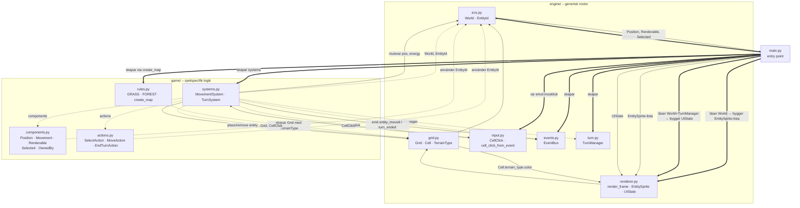

# Grid Engine

En turbaserad 2D grid-baserad spelmotor byggd i Python och Pygame. Motorn är generisk nog att driva både brädspelsliknande spel och turbaserade strategispel. Nuvarande demo: en 20×20 karta med två spelare och grundläggande rörelse.

## Kom igång

```bash
pip install pygame==2.6.1
cd game/
python main.py
```

**Krav:** Python 3.12+, Pygame 2.x

## Hur man spelar

- Klicka på din pjäs för att markera den (gul kant)
- Klicka på en angränsande ledig cell för att flytta dit
- Skog blockerar rörelse
- Varje steg kostar 1 energi (3 per tur)
- Klicka **Avsluta tur** för att lämna över till nästa spelare

---

## Modulberoenden och dataflöde



**Pilarnas betydelse:**
- `-->` normalt beroende (import)
- `-.->` game importerar från engine (tillåtet – en riktning)
- `==>` main skapar/kopplar ihop (startup)
- `-->` med label = dataflöde under körning

---

## Filbeskrivningar

### `main.py`
Startpunkten som skapar alla objekt (World, Grid, systems) och kör game loop. Det är också "bryggan" som läser data ur ECS och omvandlar den till renderingsformat (`EntitySprite`, `UIState`) – eftersom renderaren inte får importera från `game/`.

---

### `engine/ecs.py`
Definierar `World`: den centrala behållaren som lagrar alla komponenter indexerade på entity-ID. En entity är bara ett heltal; all data lever i `World` uppdelad per komponenttyp.

### `engine/grid.py`
Definierar `Grid` – en tvådimensionell array av `Cell`-objekt. Varje cell vet vilken terrängtyp den har och om en entity står på den, vilket gör gridet till sanningskällan för vad som finns var på kartan.

### `engine/renderer.py`
Tar emot färdiga renderingsstrukturer (`EntitySprite`, `UIState`) och ritar dem på skärmen – fattar inga egna beslut. Innehåller också alla fönster- och layoutkonstanter som resten av koden importerar.

### `engine/input.py`
Omvandlar en pygame-mushändelse till en `CellClick` med kolumn och rad. Vet ingenting om spelet – bara om pixlar och cellstorlek.

### `engine/events.py`
En enkel pub/sub-buss (`EventBus`) där system kan lyssna på namngivna händelser och sända data. Gör att system kan kommunicera utan att känna till varandra.

### `engine/turn.py`
`TurnManager` håller reda på vems tur det är och kan stega vidare till nästa spelare. Generisk – vet ingenting om energi, pjäser eller spelregler.

---

### `game/components.py`
Ren data utan metoder – definierar vad en entity *kan vara*: var den är (`Position`), hur den rör sig (`Movement`), hur den ser ut (`Renderable`), om den är markerad (`Selected`), och vem som äger den (`OwnedBy`).

### `game/actions.py`
Dataklasser som representerar spelarens avsikter: `SelectAction`, `MoveAction`, `EndTurnAction`. Input genererar alltid en action – aldrig direkt spellogik.

### `game/systems.py`
Innehåller spellogiken: `MovementSystem` hanterar klick → markering/rörelse och kontrollerar ägandeskap, energi och terrängpassabilitet. `TurnSystem` hanterar turslut – avancerar `TurnManager` och återställer energi för nästa spelares pjäser.

### `game/rules.py`
Definierar de konkreta terränginstanserna `GRASS` och `FOREST` som data (med `passable` och `color`), samt `create_map()` som bygger startkartan. All spelspecifik karta- och terrängkonfiguration samlas här.
